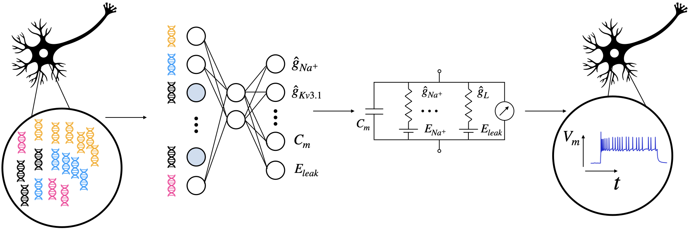

# Combined statistical-biophysical modeling links ion channel genes to physiology of cortical neuron types

*Yves Bernaerts, Michael Deistler, Pedro J. Gonçalves, Jonas Beck, Marcel Stimberg, Federico Scala, Andreas S. Tolias, Jakob Macke, Dmitry Kobak & Philipp Berens. (2025)* 

This repository contains the analysis code and the preprocessed data for the above manuscript.

## Raw data
Raw electrophysiological recordings can be publicly downloaded [here](https://dandiarchive.org/dandiset/000008/draft) corresponding to a study published in [Nature](https://www.nature.com/articles/s41586-020-2907-3). Instructions on how to do so with `dandi` are also found there. Make sure you download the data in `./data/raw_data`.
 
You will also need `SmartSeq_cells_AIBS.pickle` in `./data/` that can be downloaded from [here](https://zenodo.org/record/5118962#.Y-IkqHbMIuU).
 
Unzip file `code/save_model_parameters/favourite_training_schedule.zip` and put it in the same folder as `favourite_training_schedule.pickle`.
 
You can also download our synthetic data sets `full_batch.npz`, `best_1000_Euclidean_sims.npz` and `full_batch_without_rSS.npz` from [here](https://zenodo.org/record/7716391#.ZAsq9nbMIuV) with which we built amortized posteriors and produced main and supplementary figures, in case you do not intend to run simulations on your infrastructure. Please put `full_batch.npz` and `best_1000_Euclidean_sims.npz` in `code/save_sims/M1_chunks/` and `full_batch_without_rSS.npz` in `code/without_rSS/save_sims/M1_chunks/`.
 
The rest of the (preprocessed) data can be found in `./data/`.

## Analysis and figures
### 1. Preprocess data
Run `./code/preprocess.ipynb` (optionally) to automatically extract summary statistics of the raw electrophysiological recordings. Results can be found in `./code/pickles/M1_features.pickle`. Inspired by work found [here](https://github.com/berenslab/EphysExtraction) and [here](https://github.com/AllenInstitute/AllenSDK/tree/master/allensdk/ephys).

### 2. Build simulations
Run `./code/build_simulations.ipynb` to produce Hodgkin-Huxley-based model simulations with the simulation package Brian2 (see Requirements). We also used the parallel processing package pathos (see Requirements) that you can use if your station has multiple cpu's available. You can also set the amount of cpu's and turn off parallel processing manually (intuitively in the notebook). 

### 3. Build amortized posteriors with neural posterior estimation
Run `./code/build_amortized_posteriors.ipynb` to produce amortized posteriors set up with different training schedules. Two of the posteriors will be **NPE** and **NPE-N** discussed in the mansucript. We use the simulator-based inference package sbi (see Requirements).

### 4. Report performance
Run `./code/report_performances.ipynb` to compare the closeness of model simulations, especially based on maximum a posteriori estimates derived from the different posteriors, to experimental observations.

### 5. Deploy sparse reduced-rank regression and sparse bottleneck neural networks
Run `./code/deploy_sRRR_and_sBNN/cross-validation.ipynb` to run linear and nonlinear regression analyses that predict maximum a posteriori estimates from **NPE-N**, i.e. fitted Hodgkin-Huxley model parameters, from gene expression levels. This work is inspired by code found [here](https://github.com/berenslab/patch-seq-rrr) and [here](https://github.com/berenslab/sBNN).

### 7. Model without scaling $r_{SS}$ parameter
Run `./code/without_rSS/build_simulations.ipynb` to produce Hodgkin-Huxley model simulations without the $r_{SS}$ parameter.

### 8. Figures
Run `./figures/figure_x.ipynb` to produce Figure **x** in the manuscript.
 

## Usage
Install the following dependencies before you run the notebook.
 
`pip install -r requirements.txt`

## Update (2025)
The entire pipeline has been tested on mouse visual cortex data too from [this study](https://www.sciencedirect.com/science/article/pii/S009286742031254X). See the manuscript and code for details. Figures can be reproduced in `./figures/V1/*.ipynb` notebooks.
